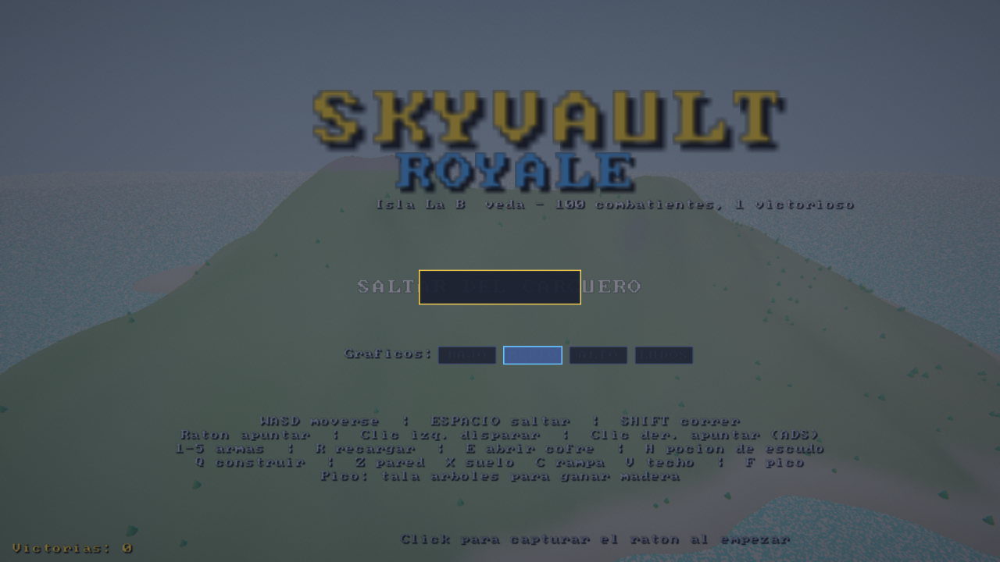
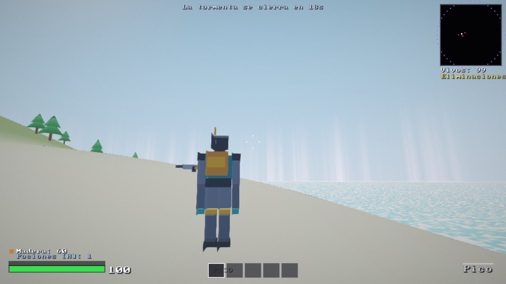
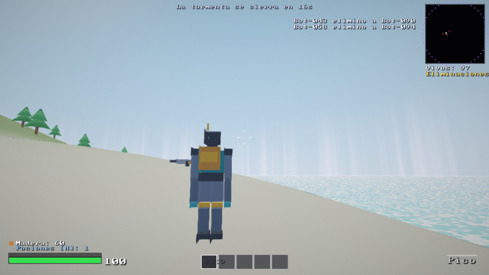
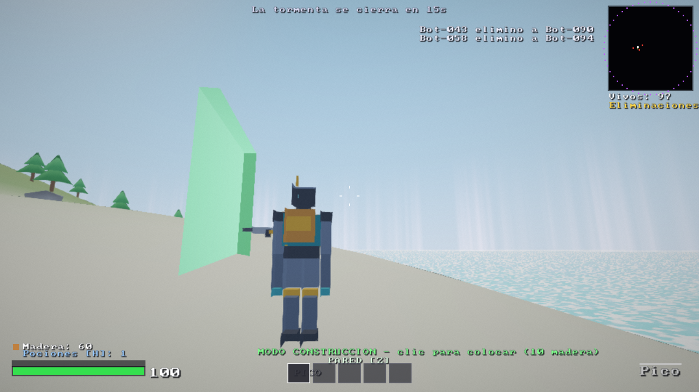

# SKYVAULT Royale — La Bóveda

Battle royale 3D con **motor 100% propio escrito en C++20** (sin engines, sin
lógica de juego en JS). Un solo código fuente, tres objetivos:

| Objetivo | Gráficos | Cómo compilar |
|---|---|---|
| Linux | OpenGL 4.6 core | `cmake -B build && cmake --build build -j` |
| Windows | OpenGL 4.6 core | `cmake -B build -G "Visual Studio 17 2022"` (GLFW+GLM vía FetchContent) |
| **Web (preview jugable)** | **WebGL2 (WASM)** | `emcmake cmake -B build-web -DSKYVAULT_WEB=ON -DCMAKE_BUILD_TYPE=Release && cmake --build build-web -j` |

Los shaders se escriben en el subconjunto común GLSL 300 es / 460 core
(preludio inyectado por plataforma), sin DSA ni compute, para que el mismo
código corra en escritorio y navegador.

> **Arte 100% original.** Todo el contenido visual del juego — personajes,
> armas, terreno, vegetación, cofres, Carguero Nube, sonidos — se genera
> por código en tiempo de compilación/inicio. No se incluye ni se descarga
> ningún asset de terceros (requisito legal del proyecto). Las únicas
> dependencias son librerías auxiliares (ventana, audio, matemáticas),
> listadas en [THIRD_PARTY_NOTICES.md](THIRD_PARTY_NOTICES.md).

## Jugar

**Opción A — GitHub Pages (recomendada):** este repositorio incluye un
workflow que compila la versión web y la publica automáticamente:

1. Sube el repo a tu cuenta de GitHub (rama `main`).
2. En el repo: **Settings → Pages → Build and deployment → Source: GitHub Actions**.
3. Abre `https://TU_USUARIO.github.io/skyvault-royale/` 🎮

**Opción B — build precompilada:** la carpeta [`docs/`](docs/) contiene una
build web lista. En **Settings → Pages → Source: Deploy from a branch →
`main` / `/docs`** se sirve sin compilar nada.

**Opción C — local:** compila el objetivo web y sirve la carpeta:

```bash
emcmake cmake -B build-web -DSKYVAULT_WEB=ON -DCMAKE_BUILD_TYPE=Release
cmake --build build-web -j
python3 -m http.server -d build-web 3000
# abre http://localhost:3000/skyvault.html
```

## Capturas

| Menú | En partida (personaje + arma procedurales) |
|---|---|
|  |  |

| Explorando la isla | Modo construcción |
|---|---|
|  |  |

## Controles

| Tecla | Acción |
|---|---|
| WASD / SHIFT / ESPACIO | mover / correr / saltar |
| Ratón | apuntar — clic izq. disparar — clic der. apuntar (ADS, zoom en francotirador) |
| 1–5 / rueda | slots de armas (1 = pico «Recolector») |
| R / E / H | recargar / abrir cofre / poción de escudo |
| Q + Z X C V | modo construir: pared / suelo / rampa / techo (10 madera) |
| F | sacar pico (tala árboles para madera) |
| L | aterrizaje rápido durante la caída (pruebas) |
| ESC | liberar el ratón |

## Qué incluye

- Isla procedural 4×4 km «La Bóveda»: volcán central con crater, 12 POIs con
  edificios, 6 biomas por altura/pendiente/humedad, lagos y playas
- Carguero Nube (dirigible) + caída libre con planeador
- 99 bots con FSM que luchan entre sí y contra ti; kill feed en vivo
- 5 armas originales con 5 rarezas: Escopeta Pistón, SMG Doble Cargador,
  Fusil Escarabajo, Francotirador Bisonte y el pico Recolector — todas con
  modelo 3D generado por código
- Tormenta de 6 fases con daño, muro volumétrico y minimapa
- Construcción por celdas de 4 m (pared/suelo/rampa/techo con HP)
- Cofres, loot por el suelo, pociones de escudo
- Render propio: PBR Cook-Torrance, sombras CSM 4 cascadas + PCF, nubes
  volumétricas por raymarch, agua con espejo real, bloom, ACES, rayos de
  dios, FXAA (presets Bajo/Medio/Alto/Ludos)
- Audio: 22 SFX sintetizados al vuelo (sin archivos de audio)
- HUD completo, menús, victoria/derrota, estadísticas persistentes (localStorage)

## Estructura

```
engine/       motor: core math json ecs memory threading world physics
              audio platform render (GL loader propio, CSM, nubes, agua, post)
game/         GameApp (main) Game (lógica) GameRender (draw calls + HUD)
              ProceduralModels (personajes y armas 100% por código)
third_party/  miniaudio stb font8x8 (auxiliares, ver THIRD_PARTY_NOTICES.md)
web/          shell.html (canvas + overlay de carga/errores)
docs/         build web precompilada para GitHub Pages
tests/        189 checks CPU del motor
```

## Publicar tu propia build en GitHub Pages

El workflow [`.github/workflows/pages.yml`](.github/workflows/pages.yml)
instala Emscripten 6.0.10, compila el objetivo web y lo despliega en cada
push a `main`. Si prefieres no usar Actions, sube la build manual:

```bash
emcmake cmake -B build-web -DSKYVAULT_WEB=ON -DCMAKE_BUILD_TYPE=Release
cmake --build build-web -j
mkdir -p docs && cp build-web/skyvault.html docs/index.html
cp build-web/skyvault.js build-web/skyvault.wasm docs/
git add docs && git commit -m "build web" && git push
```

## Límites conocidos de la preview

- Animación esquelética pendiente (personajes en pose estática; skinning en
  el formato de vértice ya preparado)
- Los bots lejanos usan simulación estadística (diseñado así)
- Sin sonido posicional 3D todavía (mezclador propio en `engine/audio`)
- El preset Alto/Ludos requiere GPU dedicada; en integradas usa Medio
- En WebGL2 el HDR depende de `EXT_color_buffer_float` (con fallback LDR)
